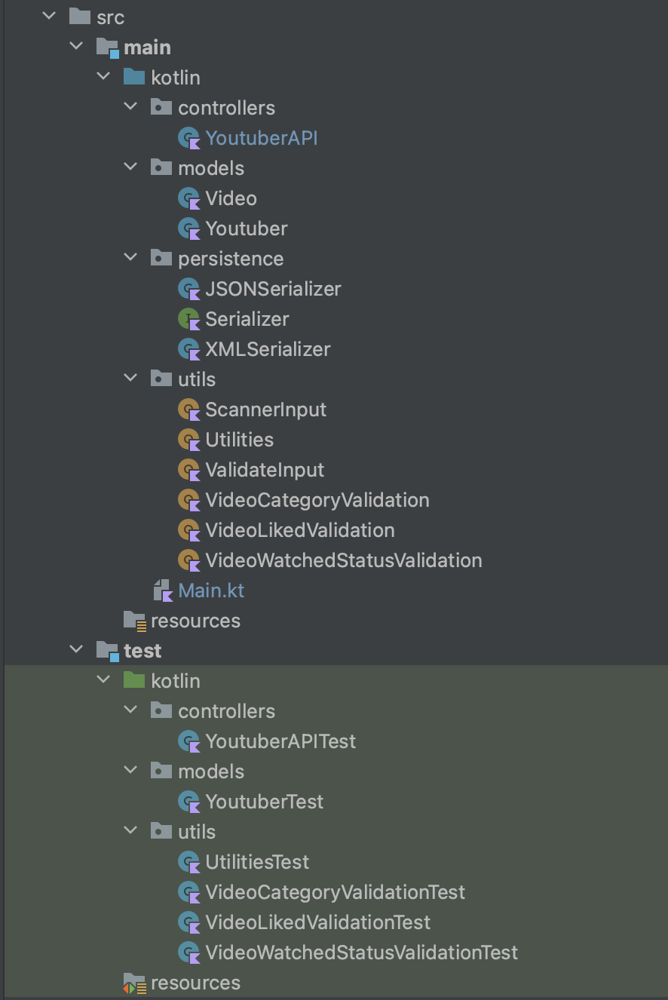

# youtuber-app
Assignment 3 for Software Development Tools

## App Overview
This is a console YouTuber app written in Kotlin.
Intellij was used to create and run this app and JUnit 5 was used for testing this app.

The app is discussed in more detail below.

## App Functionality 

In this app, you are be able to:

* Add YouTubers and Videos
* Update YouTubers and Videos
* Delete YouTubers and Videos
* List YouTubers and Videos
  * List all YouTubers
  * List favourite YouTubers
  * List non-favourite YouTubers
  * List YouTubers from Oldest-Newest Channels
  * List YouTubers from Highest-Lowest Subscribers
  * List videos linked to a chosen Youtuber
  * List watched videos
* Search YouTubers and Videos
  * Search YouTubers by channel name
  * Search YouTubers by subscriber count
  * Search videos by title
  * Search videos by category
* Add YouTubers to favourites list
* Mark videos as watched
* View information about the app
* Save and Load YouTubers

## Package Structure

**The following package structure was followed:**

## GitHub workflow

**The GitHub workflow used throughout the labs and assignment was:**

Issue - Branch - Commit(s) - Push - Pull Request - Merge - Close Issue - Delete Branch

## Gradle tasks

**Dokka and KDoc**

Kotlin's documentation generation tool is called Dokka. Dokka has a plugin for Gradle that allows the integrated documentation generations go into the build process.

The language used to document Kotlin code (the equivalent of Java's JavaDoc) is called KDoc.

Dokka and KDoc were used to create a documentation website of the Youtuber-app's code

**Gradle and Code Coverage (Jacoco)**

To generate a website of the code coverage report in the build folder, the jacoco plugin (a new capability) was added to the build.gradle.kts file in the youtuber-app

**Running the Jar**

A jar file was generated in the libs folder in the build folder of the app by running the Gradle build jar task. To successfully run the apps generated jar file in the terminal, the tasks.jar code was updated in the build.gradle.kts file. This updated code contained all the dependencies needed it in (this is often called a "fat" jar)

**Linting**

Linting is the automated checking of source code for programmatic and stylistic errors. This is done by using a lint tool (also called a linter). A lint tool is a basic static code analyser. [Source of Definition](https://www.perforce.com/blog/qac/what-lint-code-and-why-linting-important).

[ktlint](https://ktlint.github.io/) was used for linting the Youtuber-app code to check for the programmatic and stylistic errors that occurred throughout the app

## User Interface

At the beginning of developing this app, a very basic user interface (UI) was applied. A basic menu was created while functionality was being added and the YouTubers and Videos were listed in a very unpleasant way. These basic UI features are seen in releases V1.0 - V3.0.

The goal for release V4.0 and onwards, was to improve the UI within the app.

The colour theme of this app is simply red and white. The red, bright red and background red colours are from ANSI colour codes incorporated into the app. This was an obvious colour choice as the known colours that represent YouTube are red and white so these colours were chosen to keep a familiar YouTube theme going with this app.

**Welcome page**

A welcome page was added that appears before the main menu. This was added as an introduction/ease in to the app rather than going straight in with a main menu that can be overwhelming to a user as the first screen they see. Once the user is ready to move on from this screen they can click any number key followed by the enter key on their key board to get started.

**Main menu**

This is the apps main menu, it has 8 options and an exit option to choose from. The look of this menu has the same type of ASCII text used in the welcome screen, this type of ASCII text is used throughout all the sub menus also. Option 2 brings the user to the listing sub menu, option 5 brings the user to the searching sub menu and option 6 beings the user to the videos sub menu.

**Listing menu**

This is the listing sub menu, it has 5 options and an exit option to choose from. It follows a similar design to the main menu.

**Searching menu**

This is the searching sub menu, it has 2 options and an exit option to choose from. It follows a similar design to the main menu.

**Video menu**

This is the video sub menu, it has 8 options and an exit option to choose from. It follows a similar design to the main menu.

**About app screen**

This is a screen that gives users some information about the app. A ASCII YouTube logo was generated from https://manytools.org/hacker-tools/convert-images-to-ascii-art/go/ was used to go at the top of the about page that includes the about page heading inside.

**Listing a Youtuber that has a video added to them is displayed like so:**

**Listing a Youtuber that has no videos added to them is displayed like so:**

The ASCII YouTube logo generated from https://manytools.org/hacker-tools/convert-images-to-ascii-art/go/ was used again here. In the centre of the play button in the logo is there ID (number) of the Youtuber.

## References

* To help me add colour to the console output (to improve the UX/UI of my app) I used: https://www.lihaoyi.com/post/BuildyourownCommandLinewithANSIescapecodes.html

* To help me add generated ASCII text to all the menus and welcome screen (to improve the UX/UI of my app) I used: https://patorjk.com/software/taag/#p=display&f=Graceful&t=Youtuber%20menu%20app

* To help me add a generated ASCII image of the YouTube logo (to improve the UX/UI of my app) I used: https://manytools.org/hacker-tools/convert-images-to-ascii-art/go/

I also referenced these links throughout the code in comments over the related functions.
